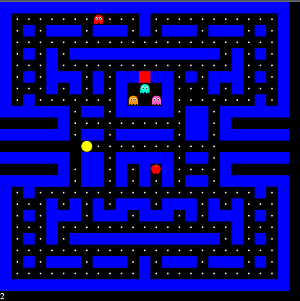

# Pacman-JS
Simple Pacman game using pure HTML, CSS, and Javascript
(Canvas implementation found in canvas-ver folder)

---

## Controls

KEYS:

up - move pacman 1 block upwards 

down - move pacman 1 block downwards

left - move pacman 1 block left

right - move pacman 1 block right

---

## Mechanics

 

A dot is **1 point**.

Eating an apple makes the ghosts scared. Worth **20 points**.

Scared ghosts can be eaten. Eaten scared ghosts is worth **200 points**. 

## GOAL

Eat all the dots to without getting eaten by the ghosts!
